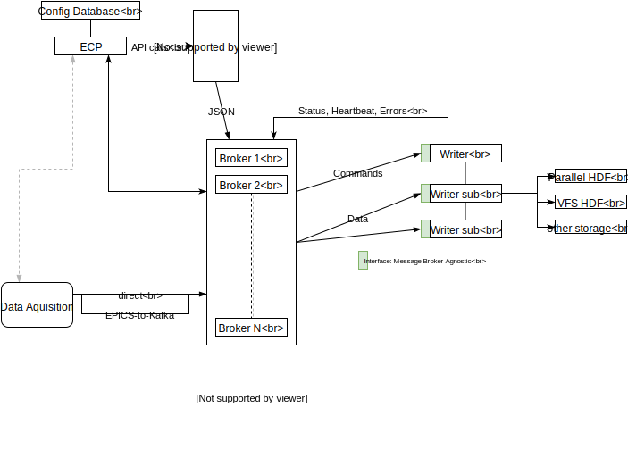

# Filewriter development docs

These are more or less outdated, kept here for archival and reference.

[NeXusFileWriterDesign](NeXusFileWriterDesign.md)




## Streamer

According to the design the Streamer connects to Kafka (other
sources to be implemented) and consumes a message in the specified topic. Some features:

- one Streamer per topic
- multiple Source per streamer
- initial timestamp is specified using ``set_start_time``
- connection to the Kafka broker is nonblocking. If the broker address is
  invalid returns an error
- Kafka::Config and streamer options can be optionally configured using
  ``kafka`` and ``streamer`` fields in the configuration file. ``kafka`` can
  contain any option that RdKafka accepts. `streamer` accetps:
  - `ms-before-start` milliseconds before the `start_time` to start writing from
    - `consumer-timeout-ms` the maximum time in milliseconds the consumer waits
      before return with error status
    - `metadata-retry` maxim number of retries to connect to specifies broker
      before return an error


## DemuxTopic

Mapped 1:1 with topics (and Streamers) drives the message to the correct Source. Derived from classes MessageProcessor and TimeDifferenceFromMessage. The former provides an interface for processing new messages (usually write on disk), the latter the interface process old messaged with the aim of find the first message sent after ECP ```start ```message.
The two corresponding methods are

* process_message
* time_difference_from_message

Both receive the message payload and size. Return values are ProcessMessageResult and TimeDifferenceFromMessage_DT.


## StreamMaster 

The StreamMaster receives the array of DemuxTopic from
FileWriterCommand and instantiates the Streamer array according to the
topics. Eventually retrieves the list of brokers from Kafka.

- `start_time` and `stop_time` can be used to set the timestamp of the first and
  last event to be written (see Streamer options);
- upon a `stop` message the ``Master`` can stop the writing; if a `status-uri`
- is configured sends a (JSON formatted) status report on the corresponding
  topic;
- a global `status` flag report the status of ``StreamMaster``. Definitions are
  in `Status::StreamMasterErrorCode` (the function `Err2Str` converts the error
  code into a human readable string). 
- each topic is written continously for at most `topic-write-interval`. This
  value can be configured in the config file (default 1000ms)
